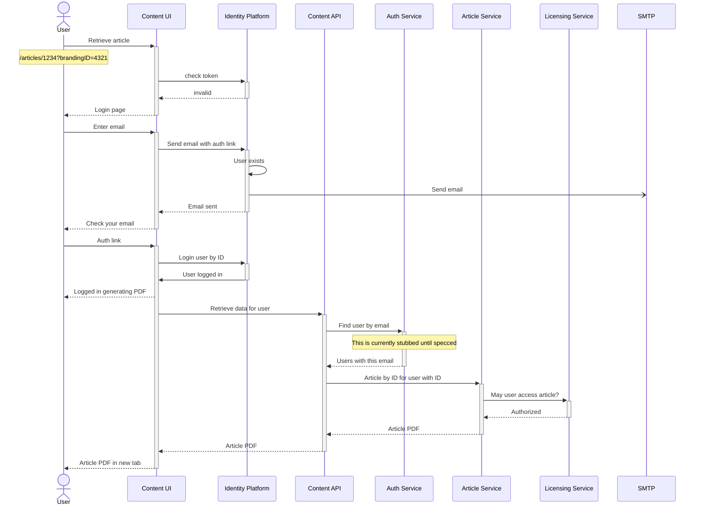

# testing

```mermaid
sequenceDiagram
    actor User
    participant ui as Content UI
    participant idp as Identity Platform
    participant content as Content API
    participant auth as Auth Service
    participant article as Article Service
    participant licensing as Licensing Service

    
    User->>+ui: Retrieve article
    Note over User: /articles/1234?brandingID=4321
    ui->>+idp: check token
    idp-->>-ui: invalid
    ui-->>-User: Login page
    
    
    User->>+ui: Enter email
    ui->>+idp: Send email with auth link
    idp->>idp: User exists
    idp-)SMTP: Send email
    idp-->>-ui: Email sent
    ui-->>-User: Check your email

    User->>+ui: Auth link
    ui->>+idp: Login user by ID
    idp->>-ui: User logged in
    ui-->>User: Logged in generating PDF

    ui->>+content: Retrieve data for user
    content->>+auth: Find user by email
    Note over auth: This is currently stubbed until specced
    auth-->>-content: Users with this email
    content->>+article: Article by ID for user with ID
    article->>+licensing: May user access article?
    licensing-->>-article: Authorized
    article-->>-content: Article PDF
    content-->>-ui: Article PDF
    ui-->>-User: Article PDF in new tab

```
